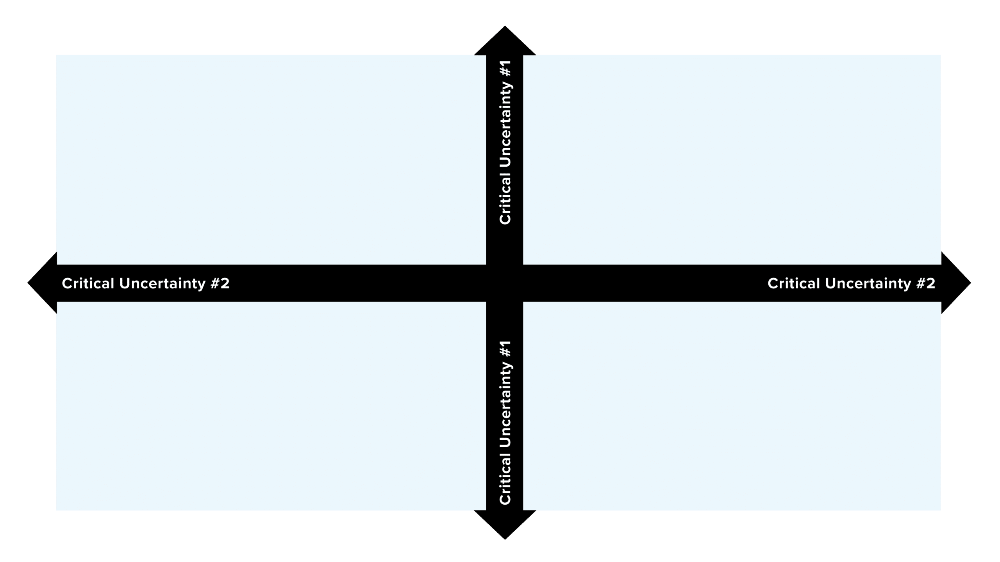

## Attribution & copyright notice

::: {style="font-size: 80%;"}

This lecture is based on the following open access materials:

- Karniadakis et al. (2021), [Physics-informed machine learning](https://www.nature.com/articles/s42254-021-00314-5).
- Ben Moseley (2021), [So, what is a physics-informed neural network?](https://benmoseley.blog/my-research/so-what-is-a-physics-informed-neural-network/).
- Maarten Grootendorst (2025), [A visual guide to LLM agents](https://newsletter.maartengrootendorst.com/p/a-visual-guide-to-llm-agents).
- Kokotajlo et al. (2025), [AI 2027](https://ai-2027.com/).
- Robert Elbrink (class 2025), [pydantic AI walkthrough](https://github.com/EAISI/pydantic-ai-walkthrough)

Source code:<br>[https://github.com/anthology-of-data-science/lecture-recent-developments-ai](https://github.com/anthology-of-data-science/lecture-recent-developments-ai)

```{=html}
<p xmlns:cc="http://creativecommons.org/ns#" >Daniel Kapitan, <em>Recent development in AI</em>.<br>This work is licensed under <a href="https://creativecommons.org/licenses/by-sa/4.0/?ref=chooser-v1" target="_blank" rel="license noopener noreferrer" style="display:inline-block;">CC BY-SA 4.0</a></p>
```
:::

## Learning objectives

<br>

:::: {.columns style="font-size: 80%;"}

::: {.column width="50%"}

### Learn

- Physics-informed machine learning and AI for scientific discovery
- Current issues in the 'AGI arms race'
- LLM agents
:::

::: {.column width="50%"}

### Do

- Case study of possible application of PIML
- Exploration of future scenarios on societal and ethical impact of AI
- Hand-on session on exploring toolkit for LLM agents and MCP

:::
::::

## Agenda
<br>

1. Lecture Physics-Informed Machine Learning
   - [presentation](https://anthology-of-data.science/lectures/piml.html)
   - [example](https://benmoseley.blog/my-research/so-what-is-a-physics-informed-neural-network/)<br><br>

2. To AI Or Not To AI: exploring critical uncertainties for the coming years<br><br>

3. LLM Agents ([link](https://anthology-of-data.science/lecture-generative-ai/#/llm-agents))


# To AI or not to AI?
## Path dependence
### source: [Wikipedia](https://en.wikipedia.org/wiki/Path_dependence)

**Path dependence** is a concept in the social sciences, referring to processes where past events or decisions constrain later events or decisions. It can be used to refer to outcomes at a single point in time or to long-run equilibria of a process. Path dependence has been used to describe institutions, **technical standards**, patterns of economic or social development, organizational behavior, and more.

:::{.notes}
This means:

- The future development of AI is affected by the path it has traced out in the past
- past events or decisions affect future events or decisions in significant or disproportionate ways, through mechanisms such as increasing returns, positive feedback effects and other mechanisms.
:::

## Step 1: exploring critical uncertainties with

<br>

- Which uncertainties do we see in the development of AI in the coming 3 years?<br><br>

- Which of these uncertainties are critical causing a major disruption in the labour market?
  - Scope: "white collar" desk-bound jobs such as call centre agents, programmers, accountants, copy-writers etc. which is roughly 40% of all jobs in the EU
  - Major disruption: more than 10% in jobs 

## Step 2: exploring scenarios with the two most critical uncertainties


## Agenda
<br>

1. Lecture Physics-Informed Machine Learning
   - [presentation](https://anthology-of-data.science/lectures/piml.html)
   - [example](https://benmoseley.blog/my-research/so-what-is-a-physics-informed-neural-network/)<br><br>

2. To AI Or Not To AI: exploring critical uncertainties for the coming years<br><br>

3. LLM Agents ([link](https://anthology-of-data.science/lecture-generative-ai/#/llm-agents))

## Thanks for your attention. {background-image="images/speakerscorner.jpg" background-size="contain" background-repeat="no-repeat"}

